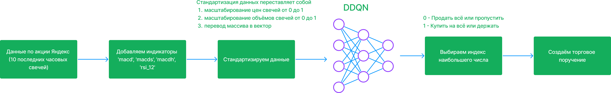
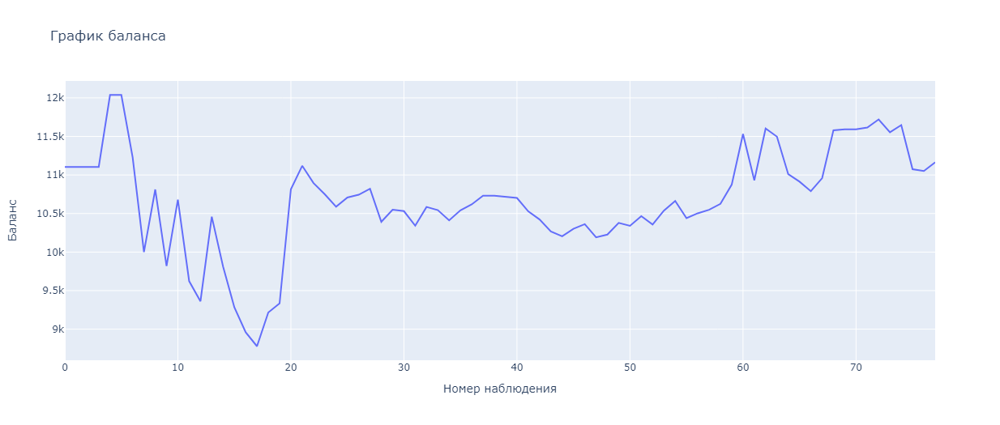
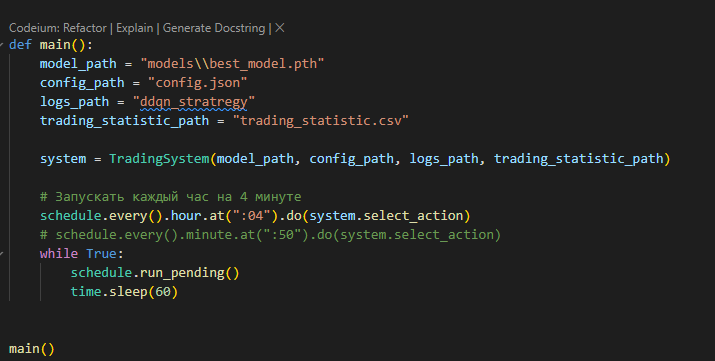
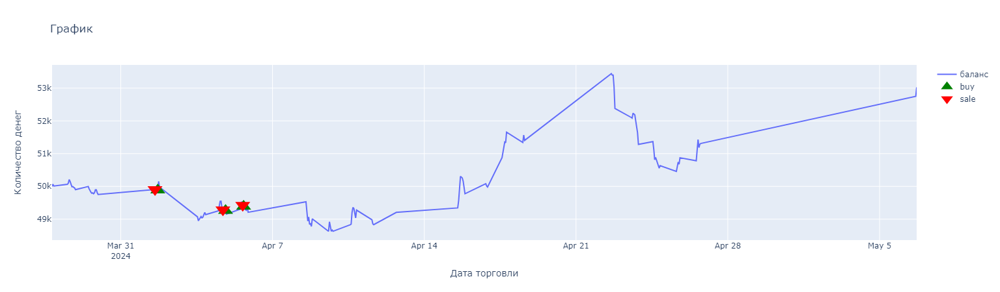
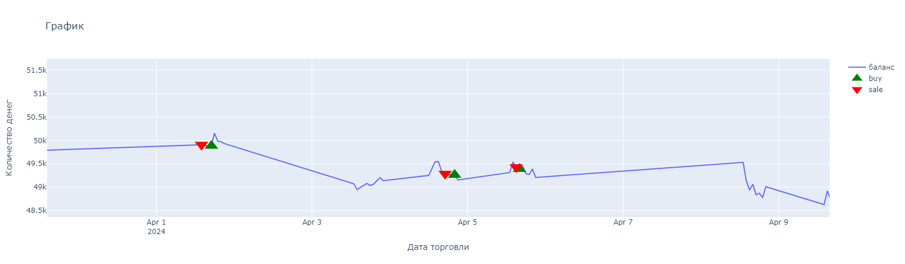
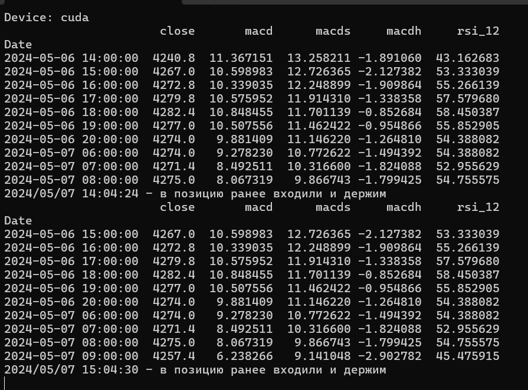

# TinkoffRobotRL

Пример работы в рамках соревнования `Tinkoff Invest Robot Contest #2` с использованием обучения с подкреплением.

## Описание подхода

Исследуя область использования машинного обучения в торговли сразу на ум приходит мысль о том, что надо строить `авторегрессионные` модели или модели на основе `LSTM` для предсказания цены акции на будущее. 

Проблема данного подхода в том, что временной ряд цены акции практически полностью не стационарный. И цена акции может измениться в любой момент времени из-за различных факторов. Но существует другой поход, который позволяет использовать нейросеть в принятии решения о `покупке` или `продаже` актива. Этот подход предполагает использования техник обучения с подкреплением. Более подробно можно прочитать в папке [статьи](статьи). 

В данной торговой стратегии использовался агент `DDQN` для предсказания наилучшего действия. Для данного подхода также требовалось создать среду обучения. Реализация данной среды можно найти в файле [multidatasetenv.ipynb](training/multidatasetenv.ipynb).

## Описание торговой стратегии

Общая концепция стратегии показана на рисунке ниже.




Порядок действий:
1. Каждый час в 4 минуты загружаем исторические данные за `30 дней` по акции `Яндекс`
2. Добавляем индикаторы `'macd', 'macds', 'macdh', 'rsi_12'`
3. Берём последние 10 свечей
4. Стандартизируем данные и превращаем массив в вектор
5. Подаём данные на вход нейросети и получаем массив из 2 чисел
6. Берём индекс максимального числа, который и являет действием которое надо выполнить

**И всё!!** Если индекс `0` - то мы продаём всё или пропускаем свечи, иначе если `1` - то покупаем на всю котлету или держим


## Обучение модели

Прежде всего для решения любой задачи обучения с подкреплением необходимы **2 "вещи"**.
1) Создать среду, симулирующую "реальный мир"
2) Продумать функцию вознаграждения.

При создании среды было выяснено, что обучения на одном активе было недостаточно, поэтому было решено сделать среду, которая возвращает состояния по нескольким.

А вот функция вознаграждения является своеобразным **творческим подходом**. Ведь нет чётких правил, поощрять агента за правильные действия. От функции вознаграждения будет зависеть напрямую то, как агент будет себя вести в среде. Лично экспериментальным путём я создал сделал данную функцию представленную ниже

` reward = (последняя оценка портфеля - максимальная оценка за 50 предыдущих шагов) * 300 - 1`

При данной функции вознаграждения у меня получился наилучший результат на валидации. Также стоит отметить, что данная функция максимизирует оценку портфеля за 50 свечей, и штрафует агента за бездействие или убыток.


**Обучение модели происходило по следующему алгоритму:**

1. Загружаем данные часовых свечей по акциям `Газпром`, `Сбер`, `ВТБ`, `Яндекс` за **1.5 года**
2. Добавляем индикаторы
3. Создаём среды: тренировочную (возвращается состояние по 4 акциям) и тестовую (используется последние 2 месяца акии Яндекса). Предварительно последние 2 месяца данных у тренировочной мы удаляем.
4. Запускаем цикл обучения. Более подробно прошу ознакомится в файле [multidatasetenv.ipynb](training/multidatasetenv.ipynb)
5. Сохраняем лучшую модель на валидации

Пример обучения модели представлен на рисунке ниже




## Торговля

Полностью реализованная торговая стратегия находиться в папке [ddqn_strategy](ddqn_strategy).

**Установка необходимых библиотек и зависимостей**

> [!IMPORTANT]
> Для использования моделей `Torch` на `cuda` используйте официальную документацию [PyTorch](https://pytorch.org/get-started/locally/)
Иначе модели будут использоваться на `cpu`.

**Далее скачайте все необходимые библиотеки**

```py
pip install -r requirements.txt
```

После установки библиотек отредактируйте `config.json`.

Пример конфиг файла
```json
{
    "TOKEN": "токен доступа",
    "account_id": "account_id",
    "app_name": "YarickVodila",
    "figi": "BBG006L8G4H1",
    "is_open": true, 
    "quantity_stock": 12,
    "is_create_new_account": false,
    "start_balance": 50000,
    "trans_commission": 0.03
}
```

- `TOKEN` - токен доступа
- `account_id` - id аккаунта
- `app_name` - app_name
- `figi` - figi инструмента на котором вы хотите торговать
- `is_open` - открыта ли позиция. Этот параметр сам меняется во время торговли
- `quantity_stock` - количество акций которые сейчас в портфеле
- `is_create_new_account` - Выставить `true` в самом начале. Будет открыт новый `account_id` со стартовым балансом, а также сбросится статистика.
- `start_balance` - начальный баланс который вы хотите использовать для тестирования
- `trans_commission` - комиссия за сделку. (P.S. Я выставил не правильно так как комиссия 0.3% -> 0.003, но заметил я это очень поздно)

Далее конфиг файл трогать не надо. Он сам перезаписывается при необходимости.

Следующий шаг это настройка файла [main_trading.py](ddqn_strategy/main_trading.py).



**Необходимые параметры для настройки**

- `model_path` - путь до вашей модели 
- `config_path` - путь до файла `config.json`
- `logs_path` - путь до лога (P.S. можно передать любую строку он не рабочий пока что так как весь лог выводится на экран)
- `trading_statistic_path` - путь до фала `trading_statistic.csv` где будет находится таблица с колонками `date`, `portfolio_valuation`, `last_price`, `action`, `quantity_stock` 
- `schedule.every().hour.at(":04").do(system.select_action)` - данная строка отвечает за время когда будет выполнятся скрипт. `04` означает что каждый час в 4 минуты мы будем проверять что нам необходимо сделать. Точнее это будет делать модель

Для автоматизации запуска виртуального окружения рекомендую сделать файл `.bat`, [пример](start_trading.bat)

## Результаты 

Результаты можно вывести с помощью файла [plot_resalt.ipynb](ddqn_strategy/plot_resalt.ipynb)

**Пример результатов моей торговли**




**Вывод лога в консоли**



Мой агент на протяжении месяца старался держать позицию и не продавать. При этом эта стратегия была довольно успешной.

## Планы и дальнейшее развитие

Так как работа на 100% ещё не выполнена, хотелось бы отметить пару пунктов, которые способствовали бы улучшению стратегии.
1. Добавить больше индикаторов
2. Использовать `Марковские сети` или `Model-based` агента
3. Улучшить функцию вознаграждения
4. Добавить модель анализа настроения по новостям
5. Использовать больше инструментов для торговли

## Вывод 

В целом я доволен результатом, так как этот конкурс помог и дал толчок реализовать данную стратегию. Если вдруг у кого-нибудь будут вопросы или предложения, то я открыт для критики и для сотрудничества.

- `telegram` -  https://t.me/YarKo9_9 
- `почта` - y.koltashev@mail.ru 
